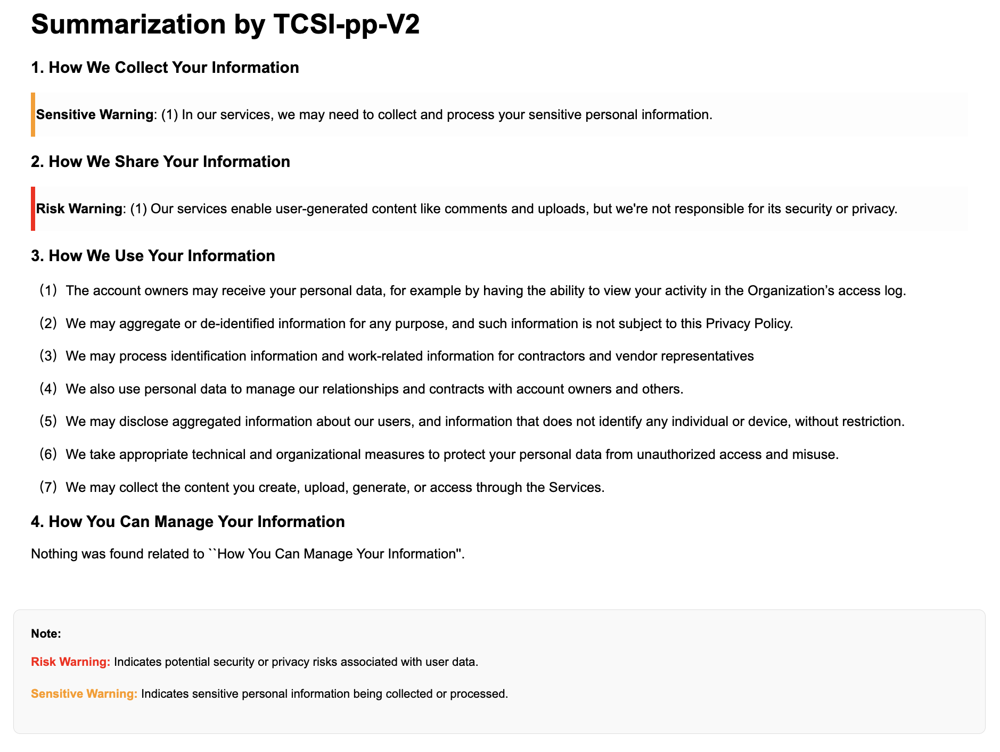

# APPSI-139: A Corpus of English Application Privacy Policy Summarization and Interpretation.

## Introduction
The privacy policy is an important statement or agreement for users to understand how service providers collect, process, store, and use personal information. However, privacy policies are often excessively long and filled with technobabble and legalese, leading most users to unknowingly accept the terms by clicking ''Agree'' or ''Join Now''. These policies may even include clauses that conflict with the law, thereby exposing users to significant privacy risks. Leveraging natural language processing (NLP) techniques to generate automated summaries of privacy policies presents a viable approach to this challenge. CAPP-130 is the first Chinese privacy policy corpus that supports both summarization and interpretation tasks. However, its English version was obtained solely through machine translation, lacking optimization for native English expression as well as the linguistic precision and legal clarity essential for policy understanding. To address this, we introduce APPSI-139, an English privacy policy corpus specifically designed for summarization and interpretation, meticulously annotated by legal experts. The corpus not only incorporates the ''Sensitivity'' label to highlight sensitive personal information and the ''Risk'' label to identify potential risks, but also provides fine-grained classification across 11 categories of data practices. In total, it consists of 139 English privacy policies, 15,692 rewritten sentences, and 36,351 fine-grained annotation labels. We further propose TCSI-pp-V2, a topic-controlled framework for summarization and interpretation privacy policies, built on end-to-end multi-task learning. Specifically designed for both training and inference on such corpora, TCSI-pp-v2 advances single-task TCSI-pp through multi-task joint modeling, with a theoretical reduction in computational cost by up to 80%. Experimental results show that models built on the TCSI-pp-v2 framework achieve accuracy comparable to that achieved by single-task learning. Furthermore, TCSI-pp-v2 outperforms large language models such as GPT-4o and LLaMA-3-70B in terms of summary readability and reliability, as evaluated through a questionnaire survey.

👉 For more details, see the [Annotation Guidelines (PNG)](Documents/Annotation_Guidelines.png) or [PDF version](Documents/Annotation_Guidelines.pdf).
<!-- [Paper](Documents/Annotation_Guidelines_Chinese_Version.pdf), [Appendix](Documents/Annotation_Guidelines_Chinese_Version.pdf) and -->
## How to Use

Install project dependencies:

```bash
pip install -r requirements.txt
```
Train a model using the following command:
```
python ./TCSI-pp-V2/[MODEL_NAME]_rewrite_ddp2_model.py
```

Run inference with the following command:
```bash
python ./Infer/main.py --topic_list choose_a_topic_list  --data privacy_path
```

✨ **new** The mt5_mtl_model (based on TCSI-pp-V2) is currently hosted at the following [link](https://huggingface.co/EnlightenedAI/APPSI-139/tree/main). Additionally, we will be uploading all associated model parameters to this same location for easy access and reference.

Figure shows a sample summarization result generated by TCSI-pp-V2:



## 📌 Update

This repository is under continuous development.  
Stay tuned for regular updates and enhancements.


